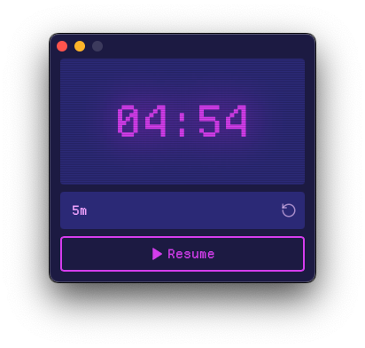

# Simple Timer

Simple af timer app made with Tauri

## Installation

[Download the latest version here](https://github.com/coffee-cup/simple-timer/releases/latest)

## How to use

1. ⏰ Enter time in plain text (e.g. 30s, 2m, 1.5d)
2. ▶︎ Press start
3. 🔈 Sound plays when time goes off

## Building Locally

- Clone this repo
- `bun run dev`
- Tauri opens
